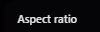

# Sophisticate

[](https://github.com/looksawful/sophisticate/actions/workflows/ci.yml)
[](https://github.com/looksawful/sophisticate/actions/workflows/pages.yml)
[](./LICENSE)

Browser-only video crop and compression tool built with Next.js and FFmpeg WASM.

**Live:** <https://looksawful.github.io/sophisticate/>

## Features

- Drag-and-drop video upload
- Real-time crop preview and aspect presets
- Optional crop and output-size constraints
- MP4 / WEBM export
- Explicit final-size enforcement when a size limit is enabled
- Cancel processing while encoding

## Development

Node 20 and FFmpeg CLI are the supported development baseline. FFmpeg CLI is used only to generate deterministic integration-test fixtures; application processing remains in the browser through FFmpeg WASM.

```bash
npm ci
npm run dev
```

## Validation

```bash
npm run check
```

This runs lint, TypeScript validation, Vitest, and the production build. Media/runtime changes also require the Chromium smoke workflow documented below.

## Engineering docs

- [Agent instructions](AGENTS.md)
- [Architecture](docs/ARCHITECTURE.md)
- [Testing and validation](docs/TESTING.md)
- [Roadmap](docs/ROADMAP.md)
- [Media pipeline audit skill](.agents/skills/media-pipeline-audit/SKILL.md)
- [Browser release smoke skill](.agents/skills/browser-release-smoke/SKILL.md)


